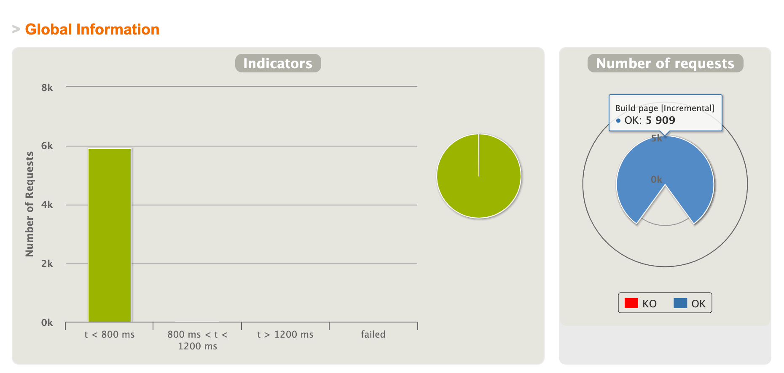
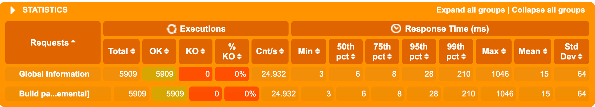
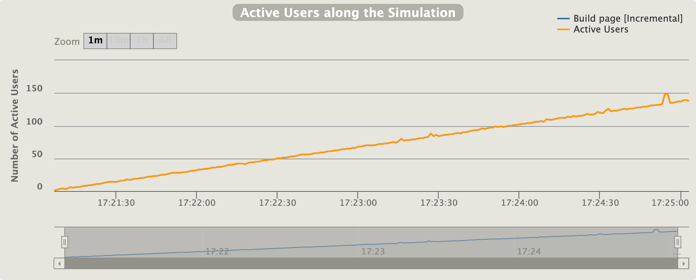
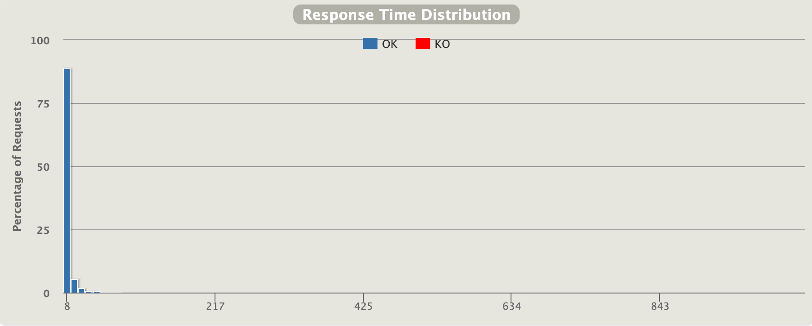
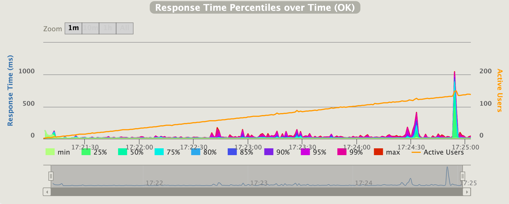
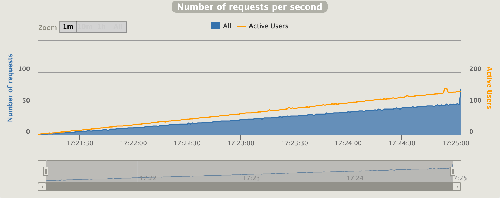
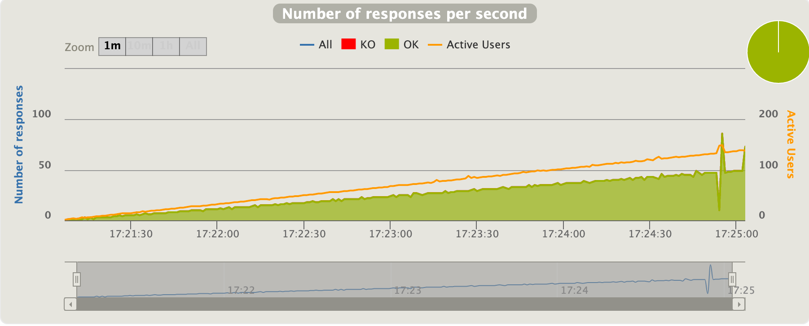
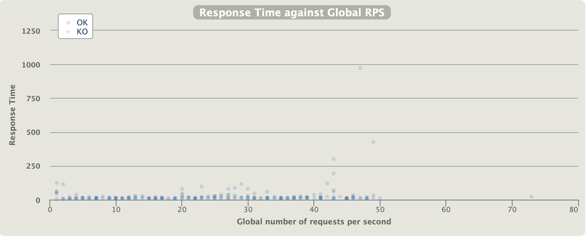

## Gatling overview

### Table of content
- [What is Gatling?](#what-is-gatling)
- [Reports](#reports)
    - [Indicators](#indicators)
    - [Statistics](#statistics)
    - [Active users among time](#active-users-among-time)
    - [Response time distribution](#response-time-distribution)
    - [Response time percentiles over time (OK)](#response-time-percentiles-over-time-ok)
    - [Number of requests per second](#number-of-requests-per-second)
    - [Number of responses per second](#number-of-responses-per-second)
    - [Response time against Global RPS](#response-time-against-global-rps)
***

### What is Gatling?

Gatling is a powerful performance testing tool that supports HTTP, WebSocket, Server-Sent-Events, and JMS. Gatling is built on top of Akka that enables thousands of virtual users on a single machine. Akka has a message-driven architecture, and this overrides the JVM limitation of handling many threads. Virtual users are not threads but messages. 

Gatling is capable of creating an immense amount of traffic from a single node, which helps to obtain the most precise information during the load testing.
***

### Reports

Gatling reports are a valuable source of information to read the performance data by providing some details about requests and response timing. 

There are the following report types in Gatling:
- Indicators
- Statistics
- Active users among time
- Response time distribution
- Response time percentiles over time (OK)
- Number of requests per second
- Number of responses per second
- Response time against Global RPS


##### Indicators

This chart shows how response times are distributed among the standard ranges.
The right panel shows the number of OK/KO requests.


##### Statistics

This table shows some standard statistics such as min, max, average, standard deviation, and percentiles globally and per request.


##### Active users among time

This chart displays the active users during the simulation: total and per scenario.

“Active users” is neither “concurrent users” or “users arrival rate”. It’s a kind of mixed metric that serves for both open and closed workload models, and that represents “users who were active on the system under load at a given second”.

It’s computed as:
```
(number of alive users at previous second)
+ (number of users that were started during this second)
- (number of users that were terminated during the previous second)
```


##### Response time distribution

This chart displays the distribution of response times.


##### Response time percentiles over time (OK)

This chart displays a variety of response time percentiles over time, but only for successful requests. As failed requests can end prematurely or be caused by timeouts, they would have a drastic effect on the percentiles computation.


##### Number of requests per second

This chart displays the number of requests sent per second overtime.


##### Number of responses per second

This chart displays the number of responses received per second overtime: total, successes, and failures.


##### Response time against Global RPS

This chart shows how the response time for the given request is distributed, depending on the overall number of requests at the same time.


## Next step
[Installing Gatling](2-installing-gatling.md)


