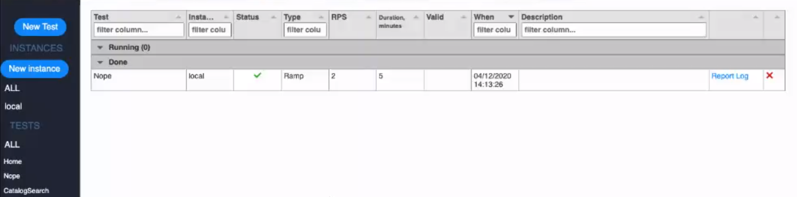
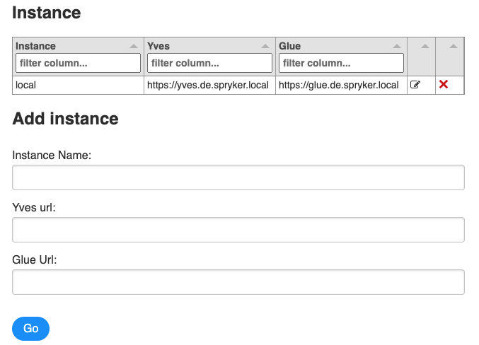
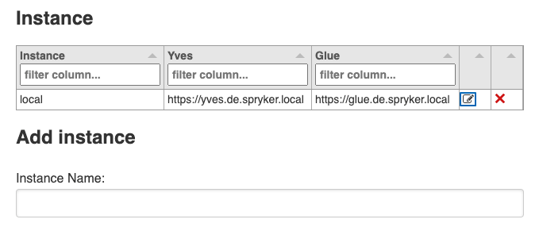
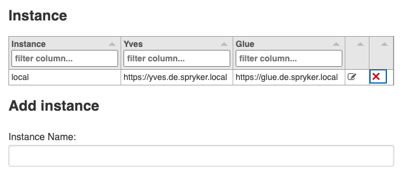
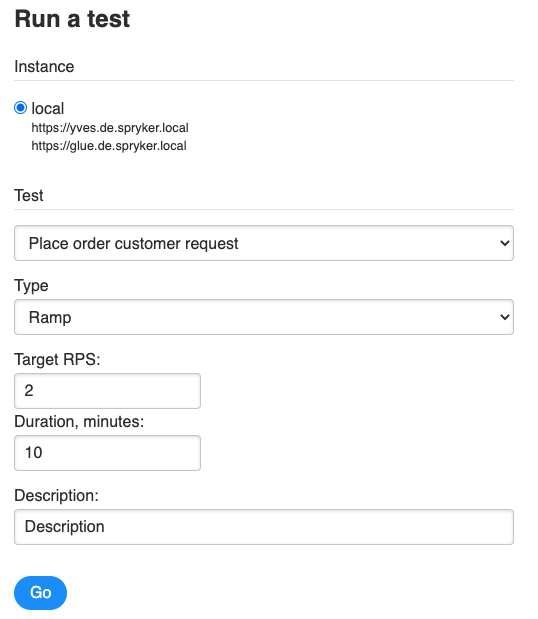
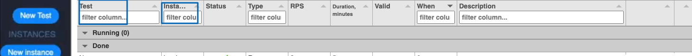
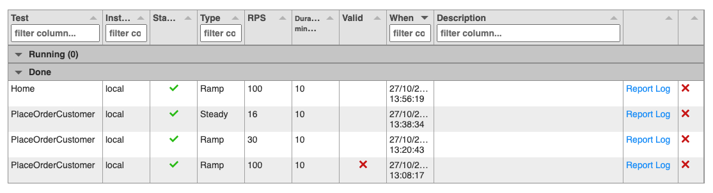
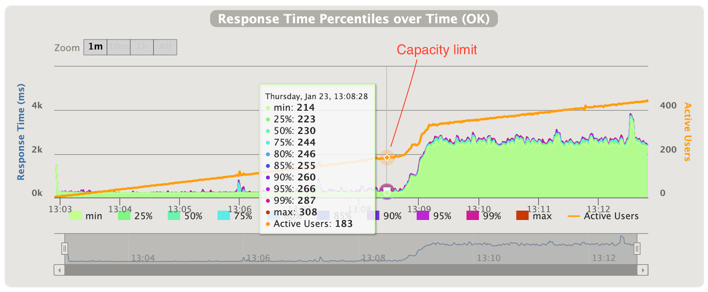
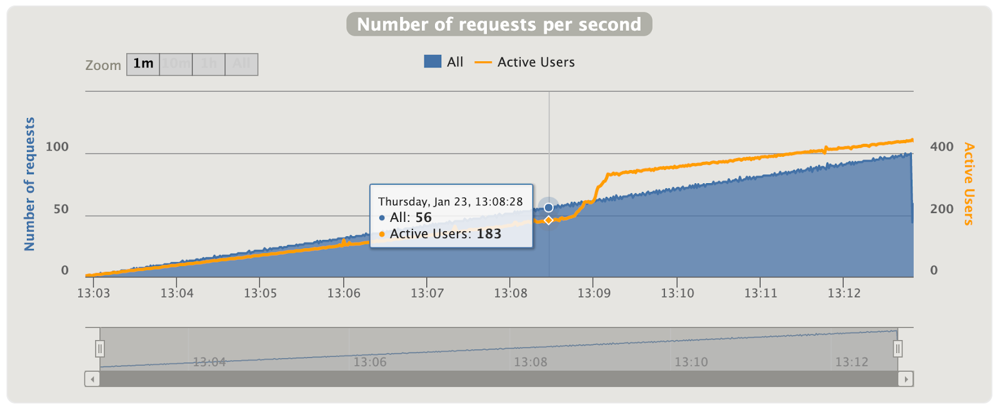

Once you have installed [Gatling](1-gatling-overview.md), you should run it to see the Web UI for testing and start using the tool. This article describes how you can do that.

## Running Gatling
To get the Web UI of the Gatling tool, run:

```bash
npm run run
```
That's it. The tool is now available at `http://localhost:3000`.


---
**Info**

The tool runs on port 3000 by default. If you want to use a different port, specify it in the PORT environment variable. For example:

```bash
PORT=80 npm run run
```

This makes the tool available at the specified port, so in our example, at `http://localhost:80`.

---

## Using Gatling

In the testing tool Web UI, you can do the following:
- Create, edit, and delete instances.
- Run one of the available tests on a specific instance.
- View detailed reports on all the available instances and tests.

You can perform all these actions from the main page:




### Managing instances

You can create new instances and edit or delete the existing ones.

#### Creating an instance

To create an instance:

1. In the navigation bar,  click **New instance**. The *Instance* page opens.

2. Enter the instance name.
3. Optional: in the Yves URL field, enter the Yves server URL.
4. Optional: in the Glue URL field, enter the GLUE API server URL.
5. Click **Go**.

Now, the new instance should appear in the navigation bar in *INSTANCES* section.


#### Editing an instance
For the already available instances, you can edit Yves URL and Glue URL. Instance names can not be edited.

To edit an instance:
1. In the navigation bar,  click **New instance**. The *Instance* page opens.
2. Click the *edit* sign next to the instance you want to edit: 

3. Edit the Yves URL or the Glue URL.
4. Click **Go**.

Now, the instance data is updated.

#### Deleting an instance
To delete an instance:
1. In the navigation bar,  click **New instance**. The *Instance* page opens.
2. Click the X sign next to the instance you want to delete: 

3. Click **Go**.
 
Your instance is now deleted.

### Running tests

To run a new load test:

1. In the navigation bar,  click **New test**. The *Run a test* page opens:

2. Select the instance you want to run the test for. See [Managing instances](#managing-instances) for information on how you can create and manage instances.
3. In the *Test* field, select the test you want to run. See [Reference information: Available tests](4-reference-information-available-tests.md) for details on the available tests.
4. In the *Type* field, select one of the test types:
	- *Ramp*: Test type with the growing load (request per second), identifies a Peak Load capacity.
	- *Steady*: Test type with the constant load, confirms reliance of a system under the Peak Load.
5. In the *Target RPS* field, set the test RPS (request per second) value.
6. In the *Duration* field, set the test duration.
7. Optional: In the *Description*, provide the test description.
8. Click **Go**.

That's it - your test should run now. While it runs, you see a page where logs are generated. Once the time you specified in the Duration field from step 6 elapses, the test stops, and you can view the detailed test report. 


### Viewing the test reports

On the main page, you can check what tests are currently being run as well as view the detailed log for the completed tests.

---
**Info**

By default, information on all instances and tests is displayed on the main page. To check details for specific tests or instances, specify them in the *Test* or *Instance* columns, respectively:


---

To check what tests are being run, on the main page, expand the *Running* section. 

To view the reports of the completed tests, on the main page, in the *Done* section, click **Report log** for the test you need:
 A new tab with the detailed Gatling reports is opened. 


## Example test: Measuring the capacity

Let's consider the example of measuring the capacity with the `AddToCustomerCart` or `AddToGuestCart` test.

During the test, Gatling calls Yves, Yves calls Zed, Zed operates with the database. Data flows through the entire infrastructure.

For the *Ramp probe* test type, the following is done:

- Ramping *Requests per second* (RPS) from 0 to 100 over 10 minutes.
- Measuring the RPS right before the outage.
- Measuring the average response time before the outage under maximum load.
  [56 RPS, 250ms]


For the *Steady probe* test type, the following is done:

- Keeping the RPS on the expected level for 30 minutes. [56 RPS]
- Checking that the response time is in acceptable boundaries. [< 400ms for 90% of requests]

